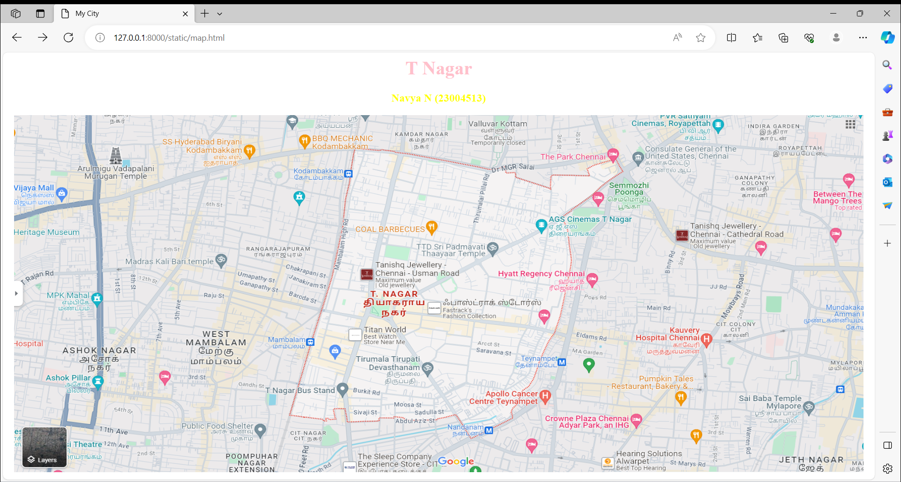

# Ex04 Places Around Me
## Date: 22-11-2023

## AIM
To develop a website to display details about the places around my house.

## DESIGN STEPS

### STEP 1
Create a Django admin interface.

### STEP 2
Download your city map from Google.

### STEP 3
Using ```<map>``` tag name the map.

### STEP 4
Create clickable regions in the image using ```<area>``` tag.

### STEP 5
Write HTML programs for all the regions identified.

### STEP 6
Execute the programs and publish them.

## CODE
``````
map.html
<html>
<head>
<title>My City</title>
</head>
<body>
<h1 align="center">
<font color="pink"><b>T Nagar</b></font>
</h1>
<h3 align="center">
<font color="yellow"><b>Navya N (23004513)</b></font>
</h3>           
<center>

<map name="MyCity">
<area shape="circle" coords="900,500,50" href="Apollo.html" title="Apollo Cancer Centre">
<area shape="circle" coords="800,260,100" href="Hyatt Regency.html" title="Hyatt Regency Chennai">
<area shape="circle" coords="920,30,90" href="Park.html" title="The Park Chennai">
<area shape="circle" coords="600,200,90" href="Coal.html" title="Coal Barbecues">
<area shape="circle" coords="900,100,90" href="Cinema.html" title="AGS Cinemas T Nagar">
</map>
</center>
</body>
</html>

Apollo.html
<html>
<head>
<title>Apollo Cancer Center</title>
</head>
<body bgcolor="blue">
<h1 align=""center>
<font color="red"><b>T Nagar</b></font>
</h1>
<h3 align="center">
<font color="Pink"><b>T Nagar - Apollo Cancer Center</b></font>
</h3>
<hr size="3" color="White">
<p align="justify">
<font face="Georgia" size="5">
 Apollo Cancer Centre, India’s first ISO certified healthcare provider is today ranked among the top super 
specialty hospitals , offering advanced tertiary care in Oncology, Orthopedics, Neurology and Neurosurgery, Head
and Neck surgery and Reconstructive and Plastic surgery.Equipped with 300 beds, the latest and the best technology,
manned by a large pool of world renowned specialists and supported by a dedicated team of medical and paramedical
professionals, Apollo Cancer Centre offers specialty healthcare of international standards with outcomes matching
those of the world’s best hospitals.</font>
</p>
</body>
</html>

Cinema.html
<html>
<head>
<title>AGS Cinemas</title>
</head>
<body bgcolor="Cyan">
<h1 align=""center>
<font color="Blue"><b>T Nagar</b></font>
</h1>
<h3 align="center">
<font color="Yellow"><b>T Nagar - AGS Cinemas</b></font>
</h3>
<hr size="3" color="Red">
<p align="justify">
<font face="Georgia" size="5">
AGS T Nagar is our choicest location and our most- priced property. Located at the shopping hub of the city, it is 
complete with state-of-the-art 4k projection, the best quality Dolby Atoms sound and multi-level-car- park that is
easily the finest. The property boasts of 4 screens well designed to provide a great reel to real experience. It is
our brain-child, we put a lot of thought and planning into building a multiplex in a crowded part of the city to 
bring cinema closer to people. We pride ourselves of making and maintaining the best stand- alone multiplexes in the
city and take great delight in bringing to people an affordable and good quality cinema viewing experience.</font>
</p>
</body>
</html>

Coal.html
<html>
<head>
<title>Coal Barbecues</title>
</head>
<body bgcolor="Green">
<h1 align=""center>
<font color="Black"><b>T Nagar</b></font>
</h1>
<h3 align="center">
<font color="Pink"><b>T Nagar - Coal Barbecues</b></font>
</h3>
<hr size="3" color="White">
<p align="justify">
<font face="Georgia" size="5">
Coal Barbecues a F&B-Fine Dining is a restaurant that offers a unique dining experience. The restaurant specializes
in barbecued dishes cooked over coal, giving the food a smoky flavor. The menu features a variety of meats, seafood,
and vegetables cooked over the coal fire. The restaurant also offers a selection of wines and craft beers to pair
with the food. The atmosphere is cozy and inviting, with a warm and friendly staff. The restaurant is the perfect
place to enjoy a delicious meal with friends and family.</font>
</p>
</body>
</html>

Hyatt Regency.html
<html>
<head>
<title>Hyatt Regency Chennai</title>
</head>
<body bgcolor="Yellow">
<h1 align=""center>
<font color="red"><b>T Nagar</b></font>
</h1>
<h3 align="center">
<font color="Blue"><b>T Nagar - Hyatt Regency Chennai</b></font>
</h3>
<hr size="3" color="Green">
<p align="justify">
<font face="Georgia" size="5">
Hyatt Regency Chennai is a modern 5-star business hotel, located centrally near major business districts, hospitals
and the U.S. Consulate. It is conveniently situated just a short distance from the nearest Metro Station and Chennai
International Airport.Hyatt Regency Chennai features 325 luxury rooms and suites with stunning views of our swimming
pool or the city. Our rooms feature modern conveniences for a comfortable stay, such as ergonomic work desks,
luxurious beds and elegant baths.</font>
</p>
</body>
</html>

Park.html
<html>
<head>
<title>The Park Chennai</title>
</head>
<body bgcolor="Pink">
<h1 align=""center>
<font color="Blue"><b>T Nagar</b></font>
</h1>
<h3 align="center">
<font color="Yellow"><b>T Nagar - The Park Chennai</b></font>
</h3>
<hr size="3" color="Red">
<p align="justify">
<font face="Georgia" size="5">
A very famous park located in one of the main spots of Chennai. The park is center of attraction for many people
around T nagar who come here for walk and to engage children in outdoor activities. The park needs more care and 
corporation must maintain the park well. After Vardah storm, the park has been damaged and they are not maintaining
it well since then.Vow green oasis in TNagar, Chennai's shopping zone. Lush green trees that are well maintained 
with a good walker's track and play area for children. Nice place to take a daily walk.</font>
</p>
</body>
</html>

``````
## OUTPUT

[Alt text](2.png)


## RESULT
The program for implementing image maps using HTML is executed successfully.
